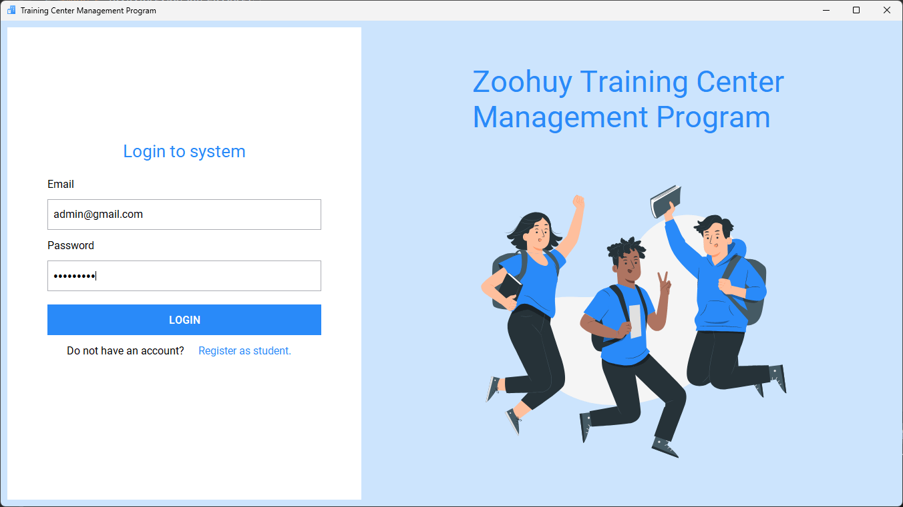
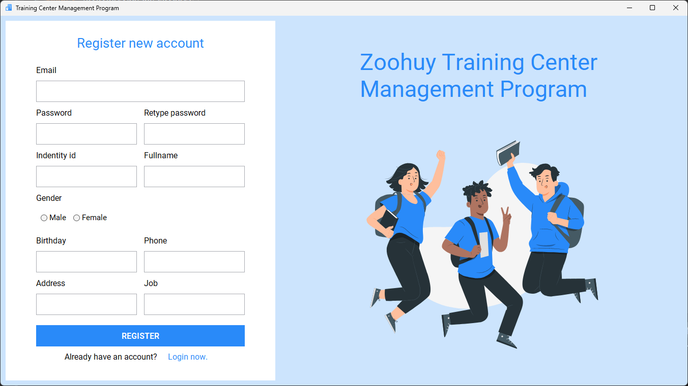
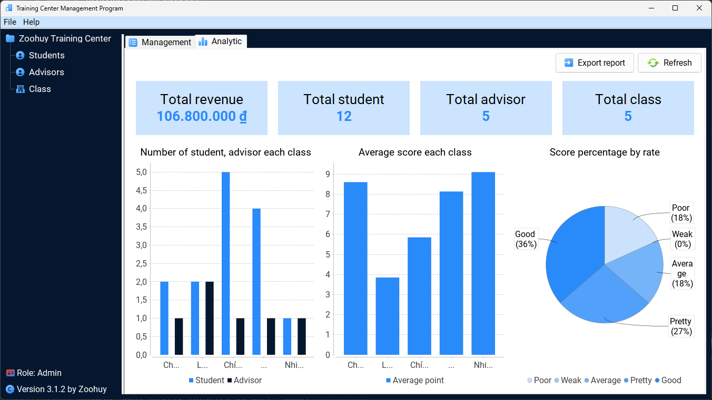
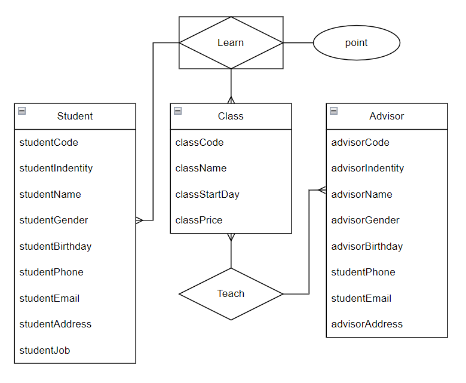
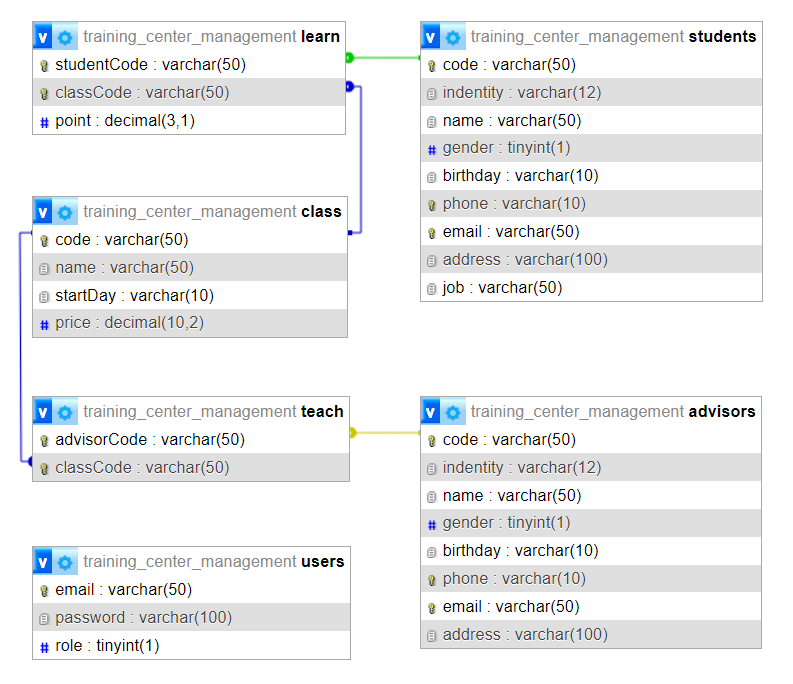

# Training Center Management
Final project in Java for managing student profiles and scores in a training center. It's my first project at VKU.

## 📍 Features
- Basic CRUD
- Search with filter
- Export data, report (xls, pdf)
- Analytic data (column chart, pie chart)

## 📃Example
<p>
  
  
</p>
<p>
  
  
</p>
<p>
  
  
</p>

## 🛠️ Built with
- Core
    - Java 20.0.2
- Library
    - mysql-connector-java 8.0.21
    - jBCrypt 0.4.1
    - jfreechart 1.5.4
    - poi 3.17
    - itextpdf 5.5.9

## ⚙️ Installation
### 1. Clone repository
```bash
git clone https://github.com/iamzoohuy/trainingCenterManagement.git
```
### 2. Install environment
- JDK (version 8 and above): Java SE Development Kit 20.0.2
    - [Windows](https://download.oracle.com/java/20/archive/jdk-20.0.2_windows-x64_bin.exe)
    - [Linux](https://download.oracle.com/java/20/archive/jdk-20.0.2_linux-x64_bin.rpm)
    - [macOS](https://download.oracle.com/java/20/archive/jdk-20.0.2_macos-aarch64_bin.dmg)
- XAMPP: XAMPP 8.0.30
    - [Windows](https://sourceforge.net/projects/xampp/files/XAMPP%20Windows/8.0.30/xampp-windows-x64-8.0.30-0-VS16-installer.exe)
    - [Linux](https://sourceforge.net/projects/xampp/files/XAMPP%20Linux/8.0.30/xampp-linux-x64-8.0.30-0-installer.run)
    - [macOS](https://sourceforge.net/projects/xampp/files/XAMPP%20Mac%20OS%20X/8.0.28/xampp-osx-8.0.28-0-installer.dmg)
### 3. Import SQL
Step 1: Run XAMPP and click start Apache and MySQL<br>
Step 2: Go to [phpMyAdmin](http://localhost/phpmyadmin)<br>
Step 3: Create new database name `training_center_management`<br>
Step 4: Import [SQL file](./training_center_management.sql) into database
### 4. Open in IDE
You can open the project with an IDE that supports Java like IntelliJ IDEA, Eclipse, NetBeans, etc. Here I use [Eclipse (2023-06)](https://www.eclipse.org/downloads/download.php?file=/oomph/epp/2023-12/R/eclipse-inst-jre-win64.exe).<br>
Open Eclipse, click `File/Import` choose type wizard `Projects from Folder or Archive` and browse to directory you cloned.

## 👉 Usage
Access to project folder, then open file `main.java` in path `trainingCenterManagement/src/trainingCenterManagement`<br>
Right click and `Run As/1 Java Application` or use shortcut `Alt + Shift + X`.

## ✒️ Diagrams
<p>
  
  
</p>

## 🫂 Contributing
If you'd like to contribute, fork the repository and use a feature branch.

## 📄 License

## 🥹 Acknowledgments
This is my first Java final project and also my first project at VKU, so I put a lot of effort into this project.<br>
I'm look forward to receiving feedback as I develop further. Thanks for viewing my project ✨.

## ✨ Support
Give a ⭐ if this project helped you!<br><br>
<a href='https://www.buymeacoffee.com/zoohuy' target='_blank'></a>
